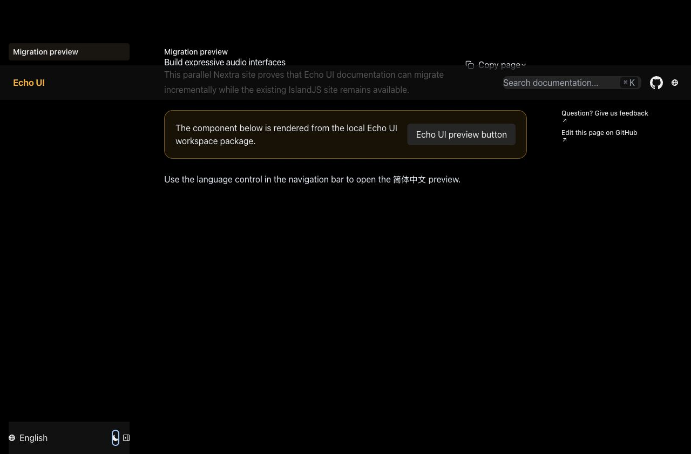
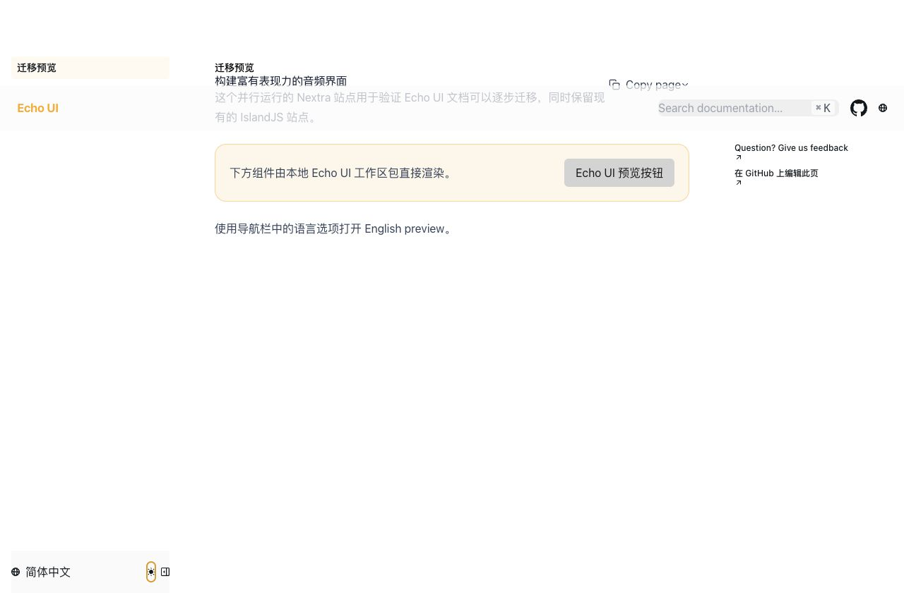

# Echo UI Nextra documentation

This workspace runs beside the IslandJS documentation while content is migrated incrementally. From the repository root:

```bash
pnpm dev:docs:nextra
pnpm build:docs:nextra
```

## Preview

| English (dark) | Chinese (light) |
| --- | --- |
|  |  |

The static export targets `https://echoui.dev` at the site root by default. For path-based preview hosting, set an absolute path without a trailing slash before building:

```bash
DOCS_BASE_PATH=/echo-ui pnpm build:docs:nextra
```

`nextra` and `nextra-theme-docs` are intentionally pinned together at 4.6.0. Version 4.6.1 moved the theme to stable Zod 4 without updating its `Layout` validation, causing every page render to fail because `children` is removed before the required schema is parsed.
